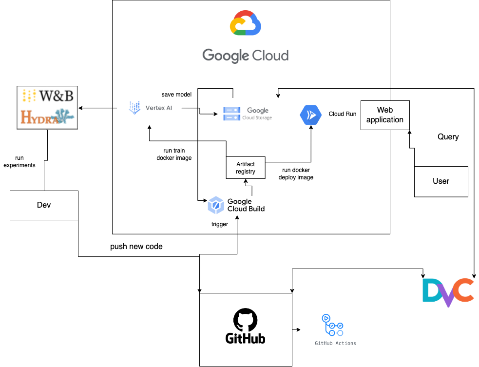

# Exam template for 02476 Machine Learning Operations

This is the report template for the exam. Please only remove the text formatted as with three dashes in front and behind
like:

```--- question 1 fill here ---```

where you instead should add your answers. Any other changes may have unwanted consequences when your report is auto
generated in the end of the course. For questions where you are asked to include images, start by adding the image to
the `figures` subfolder (please only use `.png`, `.jpg` or `.jpeg`) and then add the following code in your answer:

```markdown

```

In addition to this markdown file, we also provide the `report.py` script that provides two utility functions:

Running:

```bash
python report.py html
```

will generate an `.html` page of your report. After deadline for answering this template, we will autoscrape
everything in this `reports` folder and then use this utility to generate an `.html` page that will be your serve
as your final handin.

Running

```bash
python report.py check
```

will check your answers in this template against the constrains listed for each question e.g. is your answer too
short, too long, have you included an image when asked to.

For both functions to work it is important that you do not rename anything. The script have two dependencies that can
be installed with `pip install click markdown`.

## Overall project checklist

The checklist is *exhaustic* which means that it includes everything that you could possible do on the project in
relation the curricilum in this course. Therefore, we do not expect at all that you have checked of all boxes at the
end of the project.

### Week 1

* [x] Create a git repository
* [x] Make sure that all team members have write access to the github repository
* [x] Create a dedicated environment for you project to keep track of your packages
* [x] Create the initial file structure using cookiecutter
* [x] Fill out the `make_dataset.py` file such that it downloads whatever data you need and
* [x] Add a model file and a training script and get that running
* [x] Remember to fill out the `requirements.txt` file with whatever dependencies that you are using
* [x] Remember to comply with good coding practices (`pep8`) while doing the project
* [x] Do a bit of code typing and remember to document essential parts of your code
* [x] Setup version control for your data or part of your data
* [x] Construct one or multiple docker files for your code
* [x] Build the docker files locally and make sure they work as intended
* [x] Write one or multiple configurations files for your experiments
* [x] Used Hydra to load the configurations and manage your hyperparameters
* [] When you have something that works somewhat, remember at some point to to some profiling and see if
      you can optimize your code
* [x] Use Weights & Biases to log training progress and other important metrics/artifacts in your code. Additionally,
      consider running a hyperparameter optimization sweep.
* [x] Use Pytorch-lightning (if applicable) to reduce the amount of boilerplate in your code

### Week 2

* [x] Write unit tests related to the data part of your code
* [x] Write unit tests related to model construction and or model training
* [x] Calculate the coverage.
* [x] Get some continuous integration running on the github repository
* [x] Create a data storage in GCP Bucket for you data and preferable link this with your data version control setup
* [x] Create a trigger workflow for automatically building your docker images
* [x] Get your model training in GCP using either the Engine or Vertex AI
* [x] Create a FastAPI application that can do inference using your model
* [] If applicable, consider deploying the model locally using torchserve
* [x] Deploy your model in GCP using either Functions or Run as the backend

### Week 3

* [ ] Check how robust your model is towards data drifting
* [ ] Setup monitoring for the system telemetry of your deployed model
* [ ] Setup monitoring for the performance of your deployed model
* [ ] If applicable, play around with distributed data loading
* [ ] If applicable, play around with distributed model training
* [ ] Play around with quantization, compilation and pruning for you trained models to increase inference speed

### Additional

* [ ] Revisit your initial project description. Did the project turn out as you wanted?
* [ ] Make sure all group members have a understanding about all parts of the project
* [ ] Uploaded all your code to github

## Group information

### Question 1
> **Enter the group number you signed up on <learn.inside.dtu.dk>**
>
> Answer:

31

### Question 2
> **Enter the study number for each member in the group**
>
> Example:
>
> *sXXXXXX, sXXXXXX, sXXXXXX*
>
> Answer:

s232407 (Mattias), s180722 (Simon Daniel Eiriksson), s204117 (Magnus Harder), s184227 (Amalie Roark)

### Question 3
> **What framework did you choose to work with and did it help you complete the project?**
>
> Answer length: 100-200 words.
>
> Example:
> *We used the third-party framework ... in our project. We used functionality ... and functionality ... from the*
> *package to do ... and ... in our project*.
>
> Answer:

We used the third-party frameworks:
- item sentence-transformers
- item pytorch_lightning

The sentence-transformers framework lets us create feature embeddings for raw text data using a selection of pretrained models. This makes it possible to train a simple classification model with the feature embeddings as input, which reduces training time compared to if we would have to learn the feature embeddings from scratch. It can also be argued that using the pretrained embedding models significantly reuduces the complexity of the model design, which effectively leads to a working classification model with less work.
pytorch_lightning is used to reduce boilerplate code via its model classes. We mostly leveraged it to write clean and simple training scripts, and automatically logging together with weights and biases.

## Coding environment

> In the following section we are interested in learning more about you local development environment.

### Question 4

> **Explain how you managed dependencies in your project? Explain the process a new team member would have to go**
> **through to get an exact copy of your environment.**
>
> Answer length: 100-200 words
>
> Example:
> *We used ... for managing our dependencies. The list of dependencies was auto-generated using ... . To get a*
> *complete copy of our development environment, one would have to run the following commands*
>
> Answer:

We used pip for managing our dependencies. The list of dependencies can be auto-generated using 
```bash 
pip freeze > requirements.txt
```
 To get a complete copy of our development environment, one could for example use conda and pip, and run the following commands:
```bash
conda env create --name venv python=3.11
pip install -r requirements.txt
```
The first line creates a virtual environment named venv with python 3.11 installed in it. The second line takes all packages of specified version in the requirements.txt file and installs them as python packages in the virtual envirnoment. It is possible to use any other virtual environment manager instead of conda.
### Question 5

> **We expect that you initialized your project using the cookiecutter template. Explain the overall structure of your**
> **code. Did you fill out every folder or only a subset?**
>
> Answer length: 100-200 words
>
> Example:
> *From the cookiecutter template we have filled out the ... , ... and ... folder. We have removed the ... folder*
> *because we did not use any ... in our project. We have added an ... folder that contains ... for running our*
> *experiments.*
> Answer:

We have used and kept the overall structure of the cookiecutter template. We ended up using all the original folders from the template, and in addition have created the folders __.dvc__, __.pytest_cache__, __ruff_cache__, and __bash__ in the root directory. We also created a number of additional files, including 'ignore' files for GCP and DVC, additional requirements-files, and yaml-files e.g. one for composing dockerfiles.

Inside the project folder, __hatespeech_classification_02476__, we also ended up using all folders included in the template, for example in the data folder we filled out the make_dataset for processing the data and added another scripts called download_dataset that handles downloading the original dataset from Kaggle. Two new folders were created in the project folder: __\_pycache\___ and __conf__, the latter containing our config files for running experiments and logging information and following the recommended file structure. In addition to the _predict_model_ included in the template, we also created python files _predict_cloudfuntion_ tailored to GCP, and _app_ containing code for FastAPI.

### Question 6

> **Did you implement any rules for code quality and format? Additionally, explain with your own words why these**
> **concepts matters in larger projects.**
>
> Answer length: 50-100 words.
>
> Answer:

As part of the CI framework we set up an automatic linting pipeline using ruff. While writing the code for data manipulation, model training and deployment, we tried to follow PEP8 conventions. In the code for the FastAPI application we used typing to ensure correct input for the relevant functions. For large projects, it is important that all collaborators can quickly understand different parts of the code base. Using standard formats for writing the code makes this easier, and consequently makes the development process more effective.

## Version control

> In the following section we are interested in how version control was used in your project during development to
> corporate and increase the quality of your code.

### Question 7

> **How many tests did you implement and what are they testing in your code?**
>
> Answer length: 50-100 words.
>
> Example:
> *In total we have implemented X tests. Primarily we are testing ... and ... as these the most critical parts of our*
> *application but also ... .*
>
> Answer:

We implemented tests for the data processing pipeline as well as the model class. The data tests check that the processed data exists and has the correct dimensionality. The model tests consist of checking that an instance of the model class can be initialized, that the output of the embedding and the classification layers have correct dimensions and that a full forward pass can be done. We also test that the training and validation methods for the Pytorch Lightning module class work correctly. 

### Question 8

> **What is the total code coverage (in percentage) of your code? If you code had an code coverage of 100% (or close**
> **to), would you still trust it to be error free? Explain you reasoning.**
>
> Answer length: 100-200 words.
>
> Example:
> *The total code coverage of code is X%, which includes all our source code. We are far from 100% coverage of our **
> *code and even if we were then...*
>
> Answer:

The total code coverage for the tests is 88 %. The code coverage only tells us how much of the code that can be executed without resulting in an execution error. Even if the coverage is 100 % this does not mean that 100 % of the code does what it should. Even if the code executes it can include errors and bugs errors. To ensure that the code does not have any errors, we have to also design tests such that we cover the potential errors. Since we can not cover every single possible error case, it might be difficult to reach a total security against errors. Having some tests is however better than having none.

### Question 9

> **Did you workflow include using branches and pull requests? If yes, explain how. If not, explain how branches and**
> **pull request can help improve version control.**
>
> Answer length: 100-200 words.
>
> Example:
> *We made use of both branches and PRs in our project. In our group, each member had an branch that they worked on in*
> *addition to the main branch. To merge code we ...*
>
> Answer:

Our workflow included using branches in accordance with the recommendations. It was decided that every time we began developing a new feature, a branch would be created specifically for this. Once everything worked as intended with the new feature, we would merge the branch into main and close it. This way, the open branches served as an overview of what features were currently under development, and it was ensured that the main branch always contained the latest working version of our project.\\
For the first part of the project work we used a kind of informal pull request for main, which simply meant notifying the other team members when making changes to main. As we were all sitting together most of the time this worked quite smoothly for checking and fixing any issues and keeping everyone updated on changes. However, towards the end of the project we used GitHub's pull request when updating main. If we had been spending more time working separately, it would have been necessary to use the formal pull requests sooner to ensure that we had clear guidelines for when a change would be pushed to main, so we did not accidentally impede each others work or end up with a broken version of the project in main. 

### Question 10

> **Did you use DVC for managing data in your project? If yes, then how did it improve your project to have version**
> **control of your data. If no, explain a case where it would be beneficial to have version control of your data.**
>
> Answer length: 100-200 words.
>
> Example:
> *We did make use of DVC in the following way: ... . In the end it helped us in ... for controlling ... part of our*
> *pipeline*
>
> Answer:

Yes, we did use DVC in our project. We are not sure if it really improved our project, since that we have been working with a fixed dataset. However, it could be beneficial if our dataset included live data that would have been added to our initial dataset during the project lifetime. In that case DVC would allow us to reproduce a previous state of the project i.e. training the model on a previous version of the data would allow us to recreate results. This might be very useful if the added data had a different composition than the original dataset in which case we might like to investigate or monitor how that influenced the predictions made by our model.

### Question 11

> **Discuss you continues integration setup. What kind of CI are you running (unittesting, linting, etc.)? Do you test**
> **multiple operating systems, python version etc. Do you make use of caching? Feel free to insert a link to one of**
> **your github actions workflow.**
>
> Answer length: 200-300 words.
>
> Example:
> *We have organized our CI into 3 separate files: one for doing ..., one for running ... testing and one for running*
> *... . In particular for our ..., we used ... .An example of a triggered workflow can be seen here: <weblink>*
>
> Answer:

For CI we have set up two GitHub workflows that are both configured to execute on push. One of them runs our unit tests which allows us to confirm that our python files do not appear to be broken by the changes. This one is runs the tests for all three main operating systems to ensure that it would run for all group members and anyone evaluating the project. We decided to only support python 3.11, as we decided it would be more beneficial to spend time on other aspects on the project than resolving dependency issues between packages. We implemented caching in the workflow file, however, the resulting speedup of the runtime of the workflow is only about 10 seconds. To be able to run the tests for our data we set up a GitHub secret to allow our CI to authenticate with our DVC storage solution.
The other workflow takes care of linting by running "ruff format '*.py' which helps us maintain the desired formatting of our code files. In this workflow we only test for one operating system, Ubuntu, as it only concerns the formatting of the .py-files and thus there is nothing here that would be specific to an operating system. 
Here is a link to a GitHub actions workflow: https://github.com/Magnus-Harder/ML-Ops-31/actions/runs/7576061122/job/20634027601

## Running code and tracking experiments

> In the following section we are interested in learning more about the experimental setup for running your code and
> especially the reproducibility of your experiments.

### Question 12

> **How did you configure experiments? Did you make use of config files? Explain with coding examples of how you would**
> **run a experiment.**
>
> Answer length: 50-100 words.
>
> Example:
> *We used a simple argparser, that worked in the following way: python my_script.py --lr 1e-3 --batch_size 25*
>
> Answer:

We used hydra to configure and execute experiments for the classification model. We used config files which specify model and training parameters such as:

- Activation function
- Optimization algorithm
- Learning rate
- Batch size

To run an experiment using a config file named fro example exp.yaml, we write a script train_model.py containing a function with the hydra decorator:

@hydra.main(version_base=None, config_path="conf", config_name="config")
def train(cfg):
.
.
.

where train(cfg) contains all the training logic needed for running an experiment.
We can then run the experiment by executing the train_model.py script.

### Question 13

> **Reproducibility of experiments are important. Related to the last question, how did you secure that no information**
> **is lost when running experiments and that your experiments are reproducible?**
>
> Answer length: 100-200 words.
>
> Example:
> *We made use of config files. Whenever an experiment is run the following happens: ... . To reproduce an experiment*
> *one would have to do ...*
>
> Answer:

In conjunction with hydra, we used Weights and Biases (W & B) to automatically log data and metrics related to the experiments. Logging with W & B was setup with pytorch lightning, which helped us secure that all relevant information from the various runs of our code was stored systematically and easily accessible later. 

We made sure to configure all of our hyperparameters through our config files. This is an essential step of securing reproducibility of results (together with version control of the code and data), as explicitly defined hyperparameters prevents unintentional variations between different runs or environments (i.e. due to varying default settings). It also increases transparency, which makes it easier for others to understand and replicate the experiment. 

### Question 14

> **Upload 1 to 3 screenshots that show the experiments that you have done in W&B (or another experiment tracking**
> **service of your choice). This may include loss graphs, logged images, hyperparameter sweeps etc. You can take**
> **inspiration from [this figure](figures/wandb.png). Explain what metrics you are tracking and why they are**
> **important.**
>
> Answer length: 200-300 words + 1 to 3 screenshots.
>
> Example:
> *As seen in the first image when have tracked ... and ... which both inform us about ... in our experiments.*
> *As seen in the second image we are also tracking ... and ...*
>
> Answer:

--- question 14 fill here ---

### Question 15

> **Docker is an important tool for creating containerized applications. Explain how you used docker in your**
> **experiments? Include how you would run your docker images and include a link to one of your docker files.**
>
> Answer length: 100-200 words.
>
> Example:
> *For our project we developed several images: one for training, inference and deployment. For example to run the*
> *training docker image: `docker run trainer:latest lr=1e-3 batch_size=64`. Link to docker file: <weblink>*
>
> Answer:

In our project, we developed two images. One for training and one for deployment. The training code can either be run on our onw laptops or in a docker image on a Google Cloud Compute instance. This is because that the  runner needs authentification to write the trained model weights to a Google Cloud Bucket, which we have not been able to do on a local run of a container.

The deployment image can either be run locally or on Google Cloud Run. The local version can built with the following bash command:
```bash
docker build -f dockerfiles/deploy_model.dockerfile  . -t deploy:latest
```
And it can be deployed locally with the command
```bash
docker run --name deploy --rm deploy:latest
```

### Question 16

> **When running into bugs while trying to run your experiments, how did you perform debugging? Additionally, did you**
> **try to profile your code or do you think it is already perfect?**
>
> Answer length: 100-200 words.
>
> Example:
> *Debugging method was dependent on group member. Some just used ... and others used ... . We did a single profiling*
> *run of our main code at some point that showed ...*
>
> Answer:

We have tried to write code in pairs to identify bugs already when writing code, and when bugs did comde up, used the debugger in VSCode to find and correct these. When training and deploying our model, the parts of the code which are most time costly are those related to configuring docker containers and pulling data from a remote drive. Since we are using a third party framework for a large part of the neural network, and also for implementing training, our actual code contribution is quite small. The parts of the code we have written does therefore not affect performance significantly in proportion to the processes we have no control over. We therefore decided that it was not worth investing time on profiling the code in this project.

## Working in the cloud

> In the following section we would like to know more about your experience when developing in the cloud.

### Question 17

> **List all the GCP services that you made use of in your project and shortly explain what each service does?**
>
> Answer length: 50-200 words.
>
> Example:
> *We used the following two services: Engine and Bucket. Engine is used for... and Bucket is used for...*
>
> Answer:

We connected the Data Version Control to Google Cloud Storage (Bucket), and used this to push and pull data from our local laptops. Furthermore, we ran the model on Google Run, where it pulled data from the storage using dvc.

We also tried to use Google Cloud Functions, but since our model is rather big (>4GB) and it is built in pytorch, which also takes up much space (>4GB), our model cannot run in Google Cloud Functions, which has a storage limit of 8GB.

### Question 18

> **The backbone of GCP is the Compute engine. Explained how you made use of this service and what type of VMs**
> **you used?**
>
> Answer length: 100-200 words.
>
> Example:
> *We used the compute engine to run our ... . We used instances with the following hardware: ... and we started the*
> *using a custom container: ...*
>
> Answer:

We used Google Cloud Compute Engine to run the docker image for training models. furthermore, we used Compute Engine through Google Cloud Run, where we deployed a RESTapi API using Fastapi, which can be used for classifying textstrings over http.

### Question 19

> **Insert 1-2 images of your GCP bucket, such that we can see what data you have stored in it.**
> **You can take inspiration from [this figure](figures/bucket.png).**
>
> Answer:


### Question 20

> **Upload one image of your GCP container registry, such that we can see the different images that you have stored.**
> **You can take inspiration from [this figure](figures/registry.png).**
>
> Answer:


### Question 21

> **Upload one image of your GCP cloud build history, so we can see the history of the images that have been build in**
> **your project. You can take inspiration from [this figure](figures/build.png).**
>
> Answer:


### Question 22

> **Did you manage to deploy your model, either in locally or cloud? If not, describe why. If yes, describe how and**
> **preferably how you invoke your deployed service?**
>
> Answer length: 100-200 words.
>
> Example:
> *For deployment we wrapped our model into application using ... . We first tried locally serving the model, which*
> *worked. Afterwards we deployed it in the cloud, using ... . To invoke the service an user would call*
> *`curl -X POST -F "file=@file.json"<weburl>`*
>
> Answer:

Yes, we managed to deploy the model both locally and in the cloud. We implemented a web application using FastAPI which can be run using a docker image that takes care of all application dependencies. We tried running this both locally and on Google Cloud Run. 

A user can then interact with the application by sending a get request to the running server, with the string input as parameter, and will receive a message with the classification label.

An example of a http-request could be the following, which returns a prediction on a tweet from the training data set:
```
https://deploy-vout6xuvda-uc.a.run.app/predict?input_data=just by being able to tweet this insufferable bullshit proves trump a nazi you vagina
```

### Question 23

> **Did you manage to implement monitoring of your deployed model? If yes, explain how it works. If not, explain how**
> **monitoring would help the longevity of your application.**
>
> Answer length: 100-200 words.
>
> Example:
> *We did not manage to implement monitoring. We would like to have monitoring implemented such that over time we could*
> *measure ... and ... that would inform us about this ... behaviour of our application.*
>
> Answer:

We have not implemented monitoring of our deployed model because of time constraints. Setting up some proper monitoring for the application could help us gradually track the performance of our model as time progresses. We would then be able to detect when relevant metrics such as prediction accuracy would decrease and could take actions to remedy this. This could happen for example due to data drifting. We would also be able to identify potential bottlenecks that would come up if our application would be used by many different users at the same time. Continuously monitoring and updating a machine learning deployment is essential to keep its performance up over time.

### Question 24

> **How many credits did you end up using during the project and what service was most expensive?**
>
> Answer length: 25-100 words.
>
> Example:
> *Group member 1 used ..., Group member 2 used ..., in total ... credits was spend during development. The service*
> *costing the most was ... due to ...*
>
> Answer:

We spend a total of $16.44. The biggest expense was $8.01 on cloud storage and the second biggest expense was $6.87 on Compute Engine. See also the breakdown here:

<p align="center">
  
</p>

## Overall discussion of project

> In the following section we would like you to think about the general structure of your project.

### Question 25

> **Include a figure that describes the overall architecture of your system and what services that you make use of.**
> **You can take inspiration from [this figure](figures/overview.png). Additionally in your own words, explain the**
> **overall steps in figure.**
>
> Answer length: 200-400 words
>
> Example:
>
> *The starting point of the diagram is our local setup, where we integrated ... and ... and ... into our code.*
> *Whenever we commit code and puch to github, it auto triggers ... and ... . From there the diagram shows ...*
>
> Answer:

The main building block of the project is the project made from a cookiecutter template. This contains code and config files, which are synced with our common Github repository. Apart from this, we have data files and model files, which are synced through dvc.

Whenever someone creates a pull request from a development branch to the main branch, a Github action is triggered, which carry out a range of checks on the code. 

The code consist of two main parts: one that trains models, according to config files, and another that runs a REST API on Google Cloud Run. The training code uses Hydra for configuration, and Weights and Biases for metrics reporting.  

Whenever new code is integrated into the main branch on Github, a Google Cloud Build automatically create a new docker image to train using the new code. 

When this docker image is run, a new model is posted on a Google Bucket. This new model is then used when rebuilding the docker image containing the web application.

The github repository created from the cookiecutter template is the central element of the project setup. From a user perspective, we can either clone the code repository and run the docker images that are available in the .docker




### Question 26

> **Discuss the overall struggles of the project. Where did you spend most time and what did you do to overcome these**
> **challenges?**
>
> Answer length: 200-400 words.
>
> Example:
> *The biggest challenges in the project was using ... tool to do ... . The reason for this was ...*
>
> Answer:

In our project, we encountered significant challenges related to the integration of Google Cloud Platform (GCP) services and Data Version Control (DVC). These difficulties centered around the orchestration of data management, model training, and deployment in a cloud-based environment.

Initially, integrating GCP into our workflow took time to sort out. Configuring authentication, managing service accounts, and ensuring proper access permissions between GitHub, DVC, GCP and our local environments proved to be a tricky undertaking.

To overcome these challenges we would go through the exercises for each and try to make it work in the practice project before implementing it for our project. We would also ask Nicki and the TA's for guidance, but in some cases they also struggled to assist us. We tried following different approaches before finally arriving at an understanding of how we could set up some of the desired functionality using service accounts.

In the end, we resolved this issue by letting the prediction step run as a Google Cloud Run service, that would run a docker image with the trained model built in. The build process would then read the trained model from a public Google Bucket. 

The model training on the other hand was run on a Google Compute instance  which gave us less problems in terms of authentification.

### Question 27

> **State the individual contributions of each team member. This is required information from DTU, because we need to**
> **make sure all members contributed actively to the project**
>
> Answer length: 50-200 words.
>
> Example:
> *Student sXXXXXX was in charge of developing of setting up the initial cookie cutter project and developing of the*
> *docker containers for training our applications.*
> *Student sXXXXXX was in charge of training our models in the cloud and deploying them afterwards.*
> *All members contributed to code by...*
>
> Answer:

s232407 (Mattias): Model coding, unit tests, model training, prediction code, REST with FastAPI

s180722 (Simon Daniel Eiriksson): Setting up Google project, Google Cloud Run, Storage, docker containers, REST API web-app.

s204117 (Magnus Harder): Github repository, Model training deployment on Google Compute, model training

s184227 (Amalie Roark): Unit tests, config files, CI workflows, prediction code, REST with FastAPI
